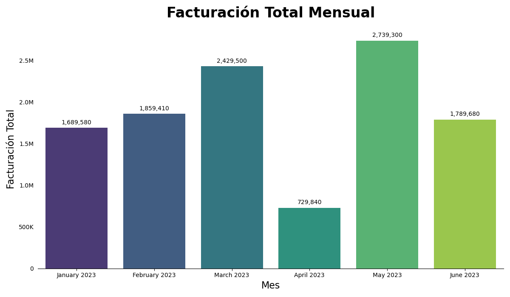

# Desafío Técnico Python: Análisis de Ventas

  

---

Este repositorio presenta una solución al desafío técnico de análisis de datos de ventas. No solo cumple con los requisitos funcionales, sino que también se desarrolla un enfoque metódico y robusto para el desarrollo de software, desde la validación inicial de la idea hasta la entrega de un producto final limpio, testeable y reproducible.

## ✨ Enfoque Estratégico

El desarrollo se abordó en dos fases clave:

1.  **Fase de Exploración (MVP en Jupyter Notebook):**
    Se utilizó un **Jupyter Notebook (`mvp.ipynb`)** para crear un Prototipo Mínimo Viable (MVP) que me permitiera una rápida exploración de los datos, la validación de la lógica de negocio y la experimentación con algunas librerías (`pandas`, `matplotlib`, `seaborn`). El objetivo fue mitigar riesgos y asegurar la viabilidad de la solución antes de invertir tiempo en el código de producción.

2.  **Fase de Producción (Refactorización a Scripts Modulares):**
    Una vez validada la lógica en el notebook, el código fue completamente refactorizado a una estructura de scripts de Python. Esta transición de un entorno de exploración a uno de producción demuestra la habilidad de escribir código **limpio, modular y mantenible**, siguiendo las mejores prácticas de la industria.

## 🚀 Características Destacadas

-   **Código Modular y Reutilizable:** La lógica de negocio está encapsulada en funciones con un propósito único dentro de `analysis_utils.py`.
-   **Pruebas Unitarias (`pytest`):** Se incluye una suite de pruebas para garantizar la fiabilidad y correctitud de los cálculos críticos (`test_analysis.py`).
-   **Persistencia de Datos (`SQLite`):** Los resultados del análisis se almacenan en una base de datos relacional para consultas futuras.
-   **Visualización Efectiva:** Se genera un gráfico de barras con formato profesional para comunicar los insights de negocio.
-   **Gestión de Dependencias:** El archivo `requirements.txt` asegura que el entorno de ejecución sea fácilmente reproducible.

## 📊 Visualización de Resultados

A continuación se muestra el gráfico de facturación mensual generado por el script:



---

## 🛠️ Guía de Uso

### Requisitos

-   Python 3.9+

### Instalación

1.  **Clonar el repositorio:**

    ```bash
    git clone https://github.com/iamseb4s/desafio-python-ventas.git
    cd desafio-python-ventas
    ```

2.  **Crear y activar un entorno virtual:**

    ```bash
    python -m venv venv
    # En Windows:
    venv\Scripts\activate
    # En macOS/Linux:
    source venv/bin/activate
    ```

3.  **Instalar dependencias:**

    ```bash
    pip install -r requirements.txt
    ```

### Ejecución del Análisis

Para ejecutar el pipeline completo, utiliza el script principal:

```bash
python main.py
```

El script realizará todo el proceso y generará los siguientes artefactos en una nueva carpeta `output/`:

-   `ventas_analisis.db`: La base de datos SQLite con los reportes.
-   `grafico.png`: La visualización de la facturación mensual.

### 🧪 Ejecución de Pruebas

Para validar la correctitud de los módulos, ejecuta `pytest` desde la raíz del proyecto:

```bash
pytest
```

### 🗃️ Consulta SQL

El archivo `queries.sql` contiene una consulta de ejemplo para obtener los 3 productos con mayor facturación. Para usarla:

```bash
sqlite3 output/ventas_analisis.db < queries.sql
```